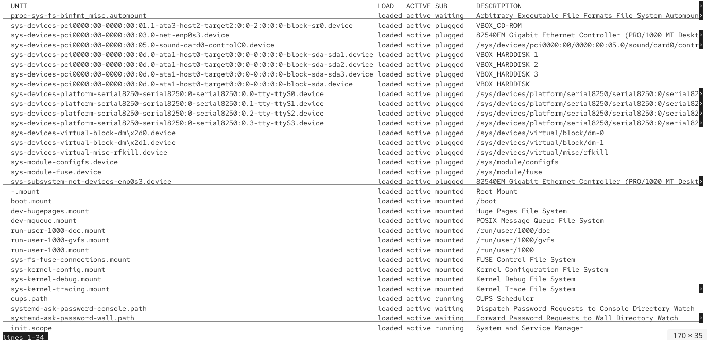
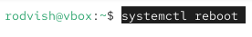

---
## Front matter
lang: ru-RU
title: Операционные системы
subtitle: Управление загрузкой системы
author:
  - Вишняков Родион Сергеевич
institute:
  - Российский университет дружбы народов, Москва, Россия
date: 22 ноября

## i18n babel
babel-lang: russian
babel-otherlangs: english

## Formatting pdf
toc: false
toc-title: Содержание
slide_level: 2
aspectratio: 169
section-titles: true
theme: Madrid
---

# Цели и задачи работы

## Цель лабораторной работы

Получить навыки работы с загрузчиком системы GRUB2.

# Процесс выполнения лабораторной работы

## Получаем полномочия администратора

{ #fig:001 width=70% height=70% }

## В файле /etc/default/grub установили параметр отображения меню загрузки в течение 10 секунд

{ #fig:002 width=70% height=70% }

## Записали изменения в GRUB2, введя в командной строке

{ #fig:003 width=70% height=70% }

## Просмотрели список всех файлов модулей, которые загружены в настоящее время

{ #fig:004 width=70% height=70% }

## Просмотрели задействованные переменные среды оболочки

{ #fig:005 width=70% height=70% }

## Просмотрели список всех загруженных файлов модулей

{ #fig:005 width=70% height=70% }

## Перезагрузили систему

{ #fig:005 width=70% height=70% }

# Выводы по проделанной работе

## Вывод

Мы получили навыки работы с загрузчиком системы GRUB2.

