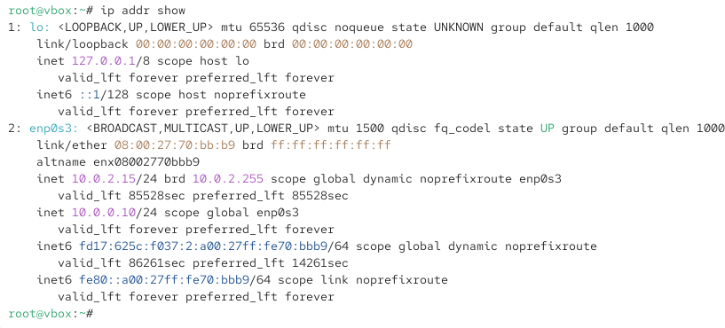
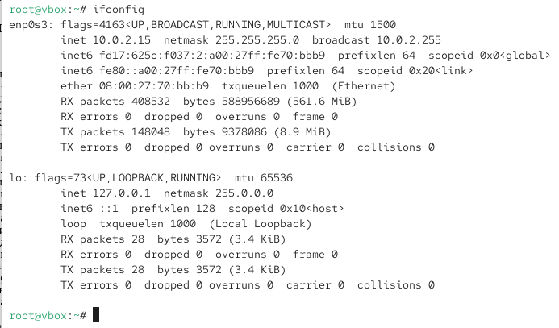
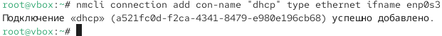
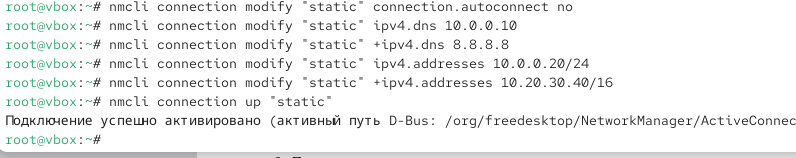

---
## Front matter
title: "Отчёт по лабораторной работе 12"
subtitle: "Настройки сети в Linux"
author: "Вишняков Родион Сергеевич"

## Generic otions
lang: ru-RU
toc-title: "Содержание"

## Bibliography

## Pdf output format
toc: true # Table of contents
toc-depth: 2
lof: true # List of figures
lot: true # List of tables
fontsize: 12pt
linestretch: 1.5
papersize: a4
documentclass: scrreprt
## I18n polyglossia
polyglossia-lang:
  name: russian
  options:
	- spelling=modern
	- babelshorthands=true
polyglossia-otherlangs:
  name: english
## I18n babel
babel-lang: russian
babel-otherlangs: english
## Fonts
mainfont: IBM Plex Serif
romanfont: IBM Plex Serif
sansfont: IBM Plex Sans
monofont: IBM Plex Mono
mathfont: STIX Two Math
mainfontoptions: Ligatures=Common,Ligatures=TeX,Scale=0.94
romanfontoptions: Ligatures=Common,Ligatures=TeX,Scale=0.94
sansfontoptions: Ligatures=Common,Ligatures=TeX,Scale=MatchLowercase,Scale=0.94
monofontoptions: Scale=MatchLowercase,Scale=0.94,FakeStretch=0.9
mathfontoptions:
## Biblatex
  - parentracker=true
  - backend=biber
  - hyperref=auto
  - language=auto
  - autolang=other*
  - citestyle=gost-numeric
## Pandoc-crossref LaTeX customization
figureTitle: "Рис."
tableTitle: "Таблица"
listingTitle: "Листинг"
lofTitle: "Список иллюстраций"
lotTitle: "Список таблиц"
lolTitle: "Листинги"
## Misc options
indent: true
header-includes:
  - \usepackage{indentfirst}
  - \usepackage{float} # keep figures where there are in the text
  - \floatplacement{figure}{H} # keep figures where there are in the text
---

# Цель работы

Получить навыки настройки сетевых параметров системы.

# Выполнение лабораторной работы

Получаем полномочия администратора

{ #fig:001 width=70% height=70% }

Выводим на экран информацию о существующих сетевых подключениях, а также статистику о количестве отправленных пакетов и связанных с ними сообщениях об ошибках

{ #fig:002 width=70% height=70% }

Выведим на экран информацию о текущих маршрутах

{ #fig:003 width=70% height=70% }

Выведите на экран информацию о текущих назначениях адресов для сетевых интерфейсов на устройстве

{ #fig:004 width=70% height=70% }

Используя команду ping для проверки правильности подключения к Интернету

{ #fig:005 width=70% height=70% }

Добавляю дополнительный адрес к вашему интерфейсу

{ #fig:005 width=70% height=70% }

Проверяю, что адрес добавился

{ #fig:005 width=70% height=70% }

Сравниваю вывод информации от утилиты ip и от команды ifconfig

{ #fig:006 width=70% height=70% }

Вывожу на экран список всех прослушиваемых системой портов UDP и TCP

{ #fig:006 width=70% height=70% }

Вывожу на экран информацию о текущих соединениях

{ #fig:007 width=70% height=70% }

Добавляю Ethernet-соединение с именем dhcp к интерфейсу

{ #fig:007 width=70% height=70% }

Добавляю к этому же интерфейсу Ethernet-соединение с именем static, статическим
IPv4-адресом адаптера и статическим адресом шлюза

{ #fig:007 width=70% height=70% }

Вывожу информацию о текущих соединениях

{ #fig:008 width=70% height=70% }

Переключаюсь на статическое соединение и проверяю успешность переключения 

{ #fig:009 width=70% height=70% }
 
Переключаюсь на соединение dhcp и проверяю успешность переключения 

{ #fig:001 width=70% height=70% }

Отключаю автоподключение статического соединение, добавляю DNS-сервер 1 и DNS-серевер 2, изменяю IP-адрес, добавляю другой IP-адрес, и активирую 

{ #fig:009 width=70% height=70% }

Используя nmtui, просматриваю настройки сети на устройстве

{ #fig:009 width=70% height=70% }

Посматриваю настройки сетевых соединений

{ #fig:009 width=70% height=70% }

Переключаюсь на первоначальное сетевое соединение

{ #fig:009 width=70% height=70% }

# Вывод

Мы получили навыки настройки сетевых параметров системы.

# Контрольные вопросы

1. Вопрос: Какая команда отображает только статус соединения, но не IP-адрес?
Ответ: Команда ip link show.

2. Вопрос: Какая служба управляет сетью в ОС типа RHEL?
Ответ:Служба NetworkManager.

3. Вопрос: Какой файл содержит имя узла (устройства) в ОС типа RHEL?
Ответ: Файл /etc/hostname.

4. Вопрос: Какая команда позволяет вам задать имя узла (устройства)?
Ответ: Команда hostnamectl set-hostname.

5. Вопрос: Какой конфигурационный файл можно изменить для включения разрешения имён для конкретного IP-адреса?
Ответ: Файл /etc/hosts.

6. Вопрос: Какая команда показывает текущую конфигурацию маршрутизации?
Ответ: Команда ip route show.

7. Вопрос: Как проверить текущий статус службы NetworkManager?
Ответ: С помощью команды systemctl status NetworkManager.

8. Вопрос: Какая команда позволяет вам изменить текущий IP-адрес и шлюз по умолчанию для вашего сетевого соединения?
Ответ: Команда nmcli.
