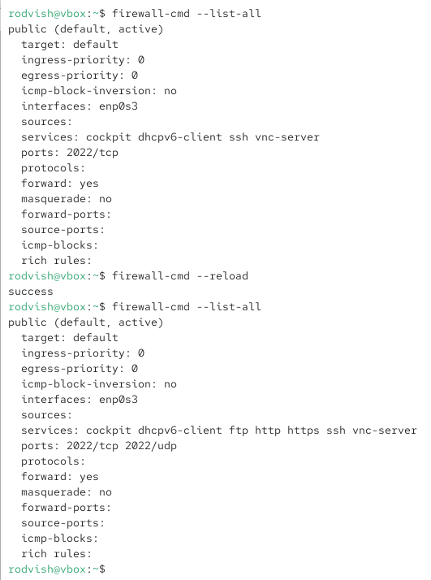

---
## Front matter
title: "Отчёт по лабораторной работе 13"
subtitle: "Фильтр пакетов"
author: "Вишняков Родион Сергеевич"

## Generic otions
lang: ru-RU
toc-title: "Содержание"

## Bibliography

## Pdf output format
toc: true # Table of contents
toc-depth: 2
lof: true # List of figures
lot: true # List of tables
fontsize: 12pt
linestretch: 1.5
papersize: a4
documentclass: scrreprt
## I18n polyglossia
polyglossia-lang:
  name: russian
  options:
	- spelling=modern
	- babelshorthands=true
polyglossia-otherlangs:
  name: english
## I18n babel
babel-lang: russian
babel-otherlangs: english
## Fonts
mainfont: IBM Plex Serif
romanfont: IBM Plex Serif
sansfont: IBM Plex Sans
monofont: IBM Plex Mono
mathfont: STIX Two Math
mainfontoptions: Ligatures=Common,Ligatures=TeX,Scale=0.94
romanfontoptions: Ligatures=Common,Ligatures=TeX,Scale=0.94
sansfontoptions: Ligatures=Common,Ligatures=TeX,Scale=MatchLowercase,Scale=0.94
monofontoptions: Scale=MatchLowercase,Scale=0.94,FakeStretch=0.9
mathfontoptions:
## Biblatex
  - parentracker=true
  - backend=biber
  - hyperref=auto
  - language=auto
  - autolang=other*
  - citestyle=gost-numeric
## Pandoc-crossref LaTeX customization
figureTitle: "Рис."
tableTitle: "Таблица"
listingTitle: "Листинг"
lofTitle: "Список иллюстраций"
lotTitle: "Список таблиц"
lolTitle: "Листинги"
## Misc options
indent: true
header-includes:
  - \usepackage{indentfirst}
  - \usepackage{float} # keep figures where there are in the text
  - \floatplacement{figure}{H} # keep figures where there are in the text
---

# Цель работы

Получить навыки настройки пакетного фильтра в Linux.

# Выполнение лабораторной работы

Получаем полномочия администратора,определяем текущую зону по умолчанию,определяем доступные зоны,смотрим службы доступные на вашем компьютере,определяем доступные службы в текущей зоне.

{ #fig:001 width=70% height=70% }

Сравниваем результаты вывода информации

{ #fig:002 width=70% height=70% }

Добавил сервер VNC в конфигурацию брандмауэра,проверил добавился ли vnc-server в конфигурацию,перезапустил службу firewalld,проверил есть ли vnc-server в конфигурации

{ #fig:003 width=70% height=70% }

Добавили службу vns-server и сделали ее постоянной,проверили наличие службы,перезагрузили конфигурацию firewalld,и просмотрели конфигурацию времени
выполнения

{ #fig:004 width=70% height=70% }

Добавили в конфигурацию межсетевого экрана порт 2022 протокола TCP,перезагрузили конфигурацию firewalld,проверили что порт добавлен в конфигурацию

{ #fig:005 width=70% height=70% }

Запустили графический интерфейс и включили http, https и ftp службы

{ #fig:005 width=70% height=70% }

Добавили новый порт в список

{ #fig:005 width=70% height=70% }

Перегрузил конфигурацию firewall-cmd и проверил новые добавления

{ #fig:006 width=70% height=70% }

Проделал задание для самостоятельной работы

{ #fig:006 width=70% height=70% }

# Вывод

Мы получили навыки настройки пакетного фильтра в Linux.

# Контрольные вопросы

1. Вопрос: Какая служба должна быть запущена перед началом работы с менеджером конфигурации брандмауэра firewall-config?
Ответ: Служба firewalld.

2. Вопрос: Какая команда позволяет добавить UDP-порт 2355 в конфигурацию брандмауэра в зоне по умолчанию?
Ответ: Команда firewall-cmd --add-port=2355/udp.

3. Вопрос: Какая команда позволяет показать всю конфигурацию брандмауэра во всех зонах?
Ответ: Команда firewall-cmd --list-all-zones.

4. Вопрос: Какая команда позволяет удалить службу vnc-server из текущей конфигурации брандмауэра?
Ответ: Команда firewall-cmd --remove-service=vnc-server.

5. Вопрос: Какая команда firewall-cmd позволяет активировать новую конфигурацию, добавленную опцией --permanent?
Ответ: Команда firewall-cmd --reload.

6. Вопрос: Какой параметр firewall-cmd позволяет проверить, что новая конфигурация была добавлена в текущую зону и теперь активна?
Ответ: Параметр --list-all.

7. Вопрос: Какая команда позволяет добавить интерфейс eno1 в зону public?
Ответ: Команда firewall-cmd --zone=public --add-interface=eno1.

8. Вопрос: Если добавить новый интерфейс в конфигурацию брандмауэра, пока не указана зона, в какую зону он будет добавлен?
Ответ: В зону по умолчанию default zone.
