---
## Front matter
lang: ru-RU
title: Операционные системы
subtitle: Управление системными службами
author:
  - Вишняков Родион Сергеевич
institute:
  - Российский университет дружбы народов, Москва, Россия
date: 22 ноября 2025

## i18n babel
babel-lang: russian
babel-otherlangs: english

## Formatting pdf
toc: false
toc-title: Содержание
slide_level: 2
aspectratio: 169
section-titles: true
theme: Madrid
---

# Цели и задачи работы

## Цель лабораторной работы

Получить навыки управления системными службами операционной системы посредством systemd.

# Процесс выполнения лабораторной работы

## Получаем полномочия администратора

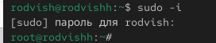{ #fig:001 width=70% height=70% }

## Проверяем статус службы Very Secure FTP

{ #fig:002 width=70% height=70% }

## Установка службы Very Secure FTP

{ #fig:003 width=70% height=70% }

## Запускаем службу Very Secure FTP

{ #fig:004 width=70% height=70% }

## Проверяю статус службы Very Secure FTP

{ #fig:005 width=70% height=70% }

## Добавляю службу Very Secure FTP в автозапуск, проверяю статус, удаляю службу и снова проверяю статус

{ #fig:005 width=70% height=70% }

## Вывожу на экран символические ссылки

{ #fig:005 width=70% height=70% }

## Снова добавляю службу Very Secure FTP в автозапуск

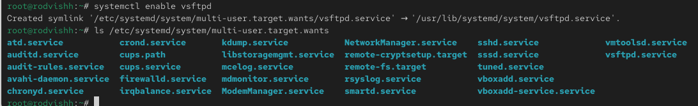{ #fig:006 width=70% height=70% }

## Проверяю статус службы Very Secure FTP

{ #fig:006 width=70% height=70% }

## Вывожу на экран список зависимостей юнита

{ #fig:007 width=70% height=70% }

## Вывожу на экран список юнитов

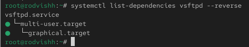{ #fig:007 width=70% height=70% }

## Установка iptables

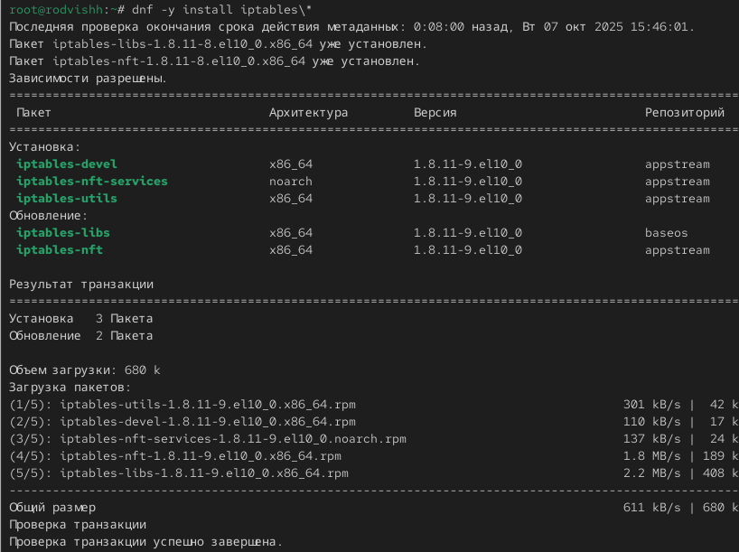{ #fig:007 width=70% height=70% }

## Проверяю статус

{ #fig:008 width=70% height=70% }

## Пробую запустить firewalld и iptables

{ #fig:009 width=70% height=70% }
 
## Ввод команды

{ #fig:010 width=70% height=70% }

## Ввод команды

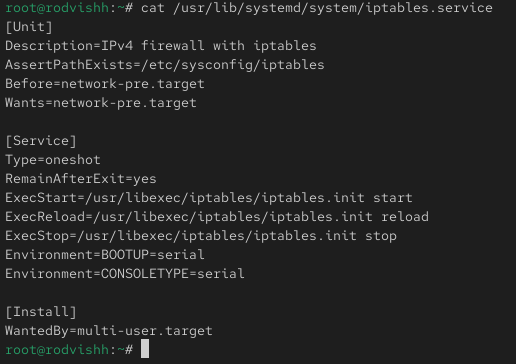{ #fig:010 width=70% height=70% }
 
## Выгружаю службу iptables и загружаю службу firewalld

{ #fig:011 width=70% height=70% }

## Заблокирую запуск iptables

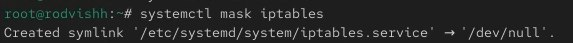{ #fig:012 width=70% height=70% }

## Пробую запустить iptables:

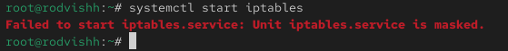{ #fig:013 width=70% height=70% }
 
## Пробую добавить iptables в автозапуск

{ #fig:014 width=70% height=70% }

## Перехожу в каталог systemd и нахожу список всех целей, которые можно изолировать

{ #fig:015 width=70% height=70% }

## Переключаю операционную систему в режим восстановления

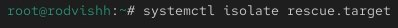{ #fig:015 width=70% height=70% }

## Перезапускаю ОС

{ #fig:015 width=70% height=70% }

## Вывожу на экран цель, установленную по умолчанию

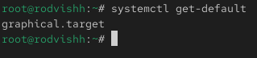{ #fig:015 width=70% height=70% }

## Запускаю текстовый режим

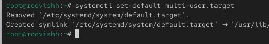{ #fig:016 width=70% height=70% }

## Запускаю графический режим

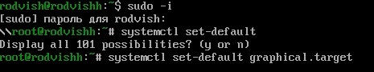{ #fig:015 width=70% height=70% }

# Выводы по проделанной работе

## Вывод

Мы получили навыки управления системными службами операционной системы посредством systemd.

