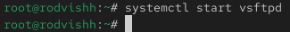
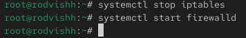
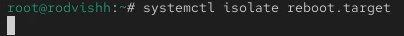

---
## Front matter
title: "Отчёт по лабораторной работе 5"
subtitle: "Управление системными службами"
author: "Вишняков Родион Сергеевич"

## Generic otions
lang: ru-RU
toc-title: "Содержание"

## Bibliography

## Pdf output format
toc: true # Table of contents
toc-depth: 2
lof: true # List of figures
lot: true # List of tables
fontsize: 12pt
linestretch: 1.5
papersize: a4
documentclass: scrreprt
## I18n polyglossia
polyglossia-lang:
  name: russian
  options:
	- spelling=modern
	- babelshorthands=true
polyglossia-otherlangs:
  name: english
## I18n babel
babel-lang: russian
babel-otherlangs: english
## Fonts
mainfont: IBM Plex Serif
romanfont: IBM Plex Serif
sansfont: IBM Plex Sans
monofont: IBM Plex Mono
mathfont: STIX Two Math
mainfontoptions: Ligatures=Common,Ligatures=TeX,Scale=0.94
romanfontoptions: Ligatures=Common,Ligatures=TeX,Scale=0.94
sansfontoptions: Ligatures=Common,Ligatures=TeX,Scale=MatchLowercase,Scale=0.94
monofontoptions: Scale=MatchLowercase,Scale=0.94,FakeStretch=0.9
mathfontoptions:
## Biblatex
  - parentracker=true
  - backend=biber
  - hyperref=auto
  - language=auto
  - autolang=other*
  - citestyle=gost-numeric
## Pandoc-crossref LaTeX customization
figureTitle: "Рис."
tableTitle: "Таблица"
listingTitle: "Листинг"
lofTitle: "Список иллюстраций"
lotTitle: "Список таблиц"
lolTitle: "Листинги"
## Misc options
indent: true
header-includes:
  - \usepackage{indentfirst}
  - \usepackage{float} # keep figures where there are in the text
  - \floatplacement{figure}{H} # keep figures where there are in the text
---

# Цель работы

Получить навыки управления системными службами операционной системы посред-
ством systemd.

# Выполнение лабораторной работы

Получаем полномочия администратора

{ #fig:001 width=70% height=70% }

Проверяем статус службы Very Secure FTP

{ #fig:002 width=70% height=70% }

Установка службы Very Secure FTP

{ #fig:003 width=70% height=70% }

Запускаем службу Very Secure FTP

{ #fig:004 width=70% height=70% }

Проверяю статус службы Very Secure FTP

{ #fig:005 width=70% height=70% }

Добавляю службу Very Secure FTP в автозапуск, проверяю статус, удаляю службу и снова проверяю статус

{ #fig:005 width=70% height=70% }

Вывожу на экран символические ссылки

{ #fig:005 width=70% height=70% }

Снова добавляю службу Very Secure FTP в автозапуск

{ #fig:006 width=70% height=70% }

Проверяю статус службы Very Secure FTP

{ #fig:006 width=70% height=70% }

Вывожу на экран список зависимостей юнита

{ #fig:007 width=70% height=70% }

Вывожу на экран список юнитов

{ #fig:007 width=70% height=70% }

Установка iptables

{ #fig:007 width=70% height=70% }

Проверяю статус

{ #fig:008 width=70% height=70% }

Пробую запустить firewalld и iptables

{ #fig:009 width=70% height=70% }
 
Ввод команды

{ #fig:010 width=70% height=70% }

Ввод команды

{ #fig:010 width=70% height=70% }
 
Выгружаю службу iptables и загружаю службу firewalld

{ #fig:011 width=70% height=70% }

Заблокирую запуск iptables

{ #fig:012 width=70% height=70% }

Пробую запустить iptables:

{ #fig:013 width=70% height=70% }
 
Пробую добавить iptables в автозапуск

{ #fig:014 width=70% height=70% }

Перехожу в каталог systemd и нахожу список всех целей, которые можно изолировать

{ #fig:015 width=70% height=70% }

Переключаю операционную систему в режим восстановления

{ #fig:015 width=70% height=70% }

Перезапускаю ОС

{ #fig:015 width=70% height=70% }

Вывожу на экран цель, установленную по умолчанию

{ #fig:015 width=70% height=70% }

Запускаю текстовый режим

{ #fig:016 width=70% height=70% }

Запускаю графический режим

{ #fig:015 width=70% height=70% }

# Вывод

Мы получили навыки управления системными службами операционной системы посред-
ством systemd.

# Контрольные вопросы

1. Что такое юнит (unit)? Приведите примеры.
О: Юнит — это базовый объект systemd (сервис, сокет, устройство, точка монтирования и т.д.). 
Примеры: `nginx.service`, `sshd.socket`, `home.mount`.

2. Какая команда позволяет убедиться, что цель больше не входит в список автоматического запуска при загрузке системы?
О: `systemctl disable <цель>`.

3. Какую команду вы должны использовать для отображения всех сервисных юнитов, которые в настоящее время загружены?
О: `systemctl list-units --type=service`.

4. Как создать потребность (wants) в сервисе?*
О: Создать символическую ссылку в `/etc/systemd/system/<цель>.wants/`: 
`systemctl add-wants <цель> <сервис>`.

5. Как переключить текущее состояние на цель восстановления (rescue target)?
О:`systemctl rescue`.

6. Поясните причину получения сообщения о том, что цель не может быть изолирована.
О: Обычно это происходит, если у цели нет собственного процесса (например, `default.target`), или отсутствуют зависимости для изоляции.

7. Вы хотите отключить службу systemd, но, прежде чем сделать это, вы хотите узнать, какие другие юниты зависят от этой службы. Какую команду вы бы использовали?
О: `systemctl list-dependencies <сервис>`.
