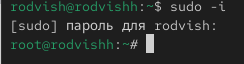
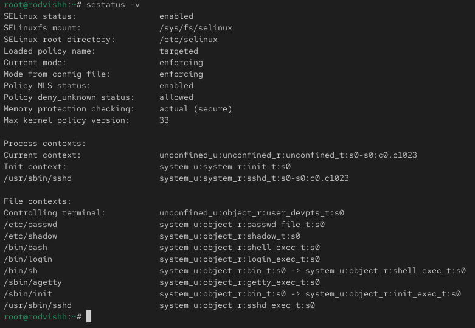
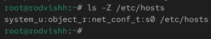
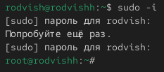
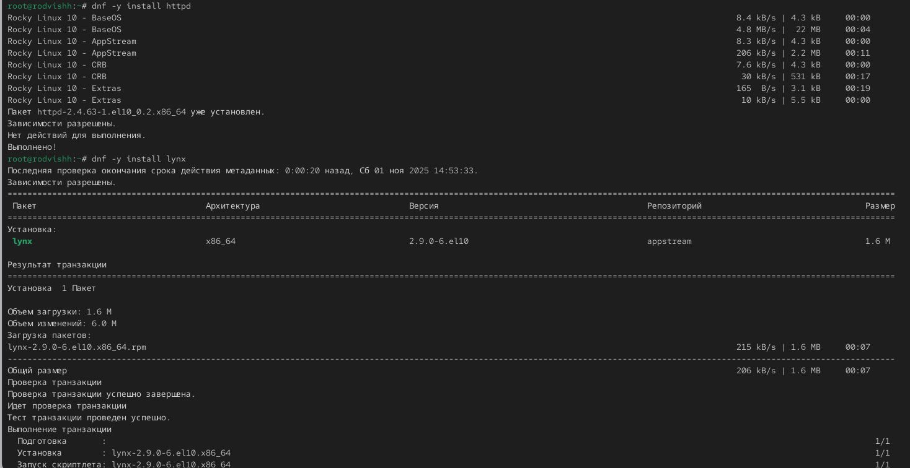
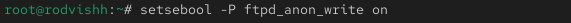

---
## Front matter
lang: ru-RU
title: Операционные системы
subtitle: Управление SELinux
author:
  - Вишняков Родион Сергеевич
institute:
  - Российский университет дружбы народов, Москва, Россия
date: 01 ноября

## i18n babel
babel-lang: russian
babel-otherlangs: english

## Formatting pdf
toc: false
toc-title: Содержание
slide_level: 2
aspectratio: 169
section-titles: true
theme: Madrid
---

# Цели и задачи работы

## Цель лабораторной работы

Получить навыки работы с контекстом безопасности и политиками SELinux.

## Задача лабораторной работы

Научиться навыкам работы с контекстом безопасности и политиками SELinux.

# Процесс выполнения лабораторной работы

## Получаем полномочия администратора

{ #fig:001 width=70% height=70% }

## Просмотрели текущую информацию о состоянии SELinux

{ #fig:002 width=70% height=70% }

## Посмотрели, в каком режиме работает SELinux

{ #fig:003 width=70% height=70% }

## В файле /etc/sysconfig/selinux с помощью редактора установили заданное значение

{ #fig:004 width=70% height=70% }

## Посмотрели статус SELinux

{ #fig:005 width=70% height=70% }

## Попробовали переключить режим работы SELinux

{ #fig:005 width=70% height=70% }

## В файле /etc/sysconfig/selinux с помощью редактора установили заданное значение

{ #fig:005 width=70% height=70% }

## Просмотрели текущую информацию о состоянии SELinux

{ #fig:006 width=70% height=70% }

## Посмотрели контекст безопасности файла /etc/hosts

{ #fig:006 width=70% height=70% }

## Скопировали файл /etc/hosts в домашний каталог и проверили контекст файла ~/hosts

{ #fig:007 width=70% height=70% }

## Попытались перезаписать существующий файл hosts из домашнего каталога в ката-
лог /etc

{ #fig:007 width=70% height=70% }

## Убедились, что тип контекста по-прежнему установлен на admin_home_t

{ #fig:007 width=70% height=70% }

## Исправили контекст безопасности

{ #fig:008 width=70% height=70% }

## Убедились, что тип контекста изменился

{ #fig:009 width=70% height=70% }
 
## Для массового исправления контекста безопасности на файловой системе ввели

{ #fig:001 width=70% height=70% }

## Получаем полномочия администратора

{ #fig:001 width=70% height=70% }

## Устанавливаем необходимое программное обеспечение

{ #fig:009 width=70% height=70% }

## Создали новое хранилище для файлов web-сервера

{ #fig:009 width=70% height=70% }

## Создали файл index.html в каталоге с контентом веб-сервера и поместили в файл следующий текст

{ #fig:009 width=70% height=70% }

## Проделываем различные действия со строками в файле /etc/httpd/conf/httpd.conf

{ #fig:009 width=70% height=70% }

## Запустили веб-сервер и службу httpd

{ #fig:009 width=70% height=70% }

## Обратились к веб-серверу в текстовом браузере lynx

{ #fig:009 width=70% height=70% }

## В терминале с полномочиями администратора применили новую метку контекста к /web

{ #fig:009 width=70% height=70% }

## Восстановили контекст безопасности

{ #fig:009 width=70% height=70% }

## Снова обращаемся к веб-серверу

{ #fig:009 width=70% height=70% }

## Посмотрели список переключателей SELinux для службы ftp

{ #fig:009 width=70% height=70% }

## Посмотрели список переключателей с пояснением

{ #fig:009 width=70% height=70% }

## Изменили текущее значение переключателя для службы ftpd_anon_write с off на on

{ #fig:009 width=70% height=70% }

## Повторно посмотрели список переключателей SELinux для службы ftpd_anon_write

{ #fig:009 width=70% height=70% }

## Изменили постоянное значение переключателя для службы ftpd_anon_write с off на on

{ #fig:009 width=70% height=70% }

## Посмотрели список переключателей

{ #fig:009 width=70% height=70% }

# Вывод по проделанной работе

## Вывод

Мы получили навыки работы с контекстом безопасности и политиками SELinux.
