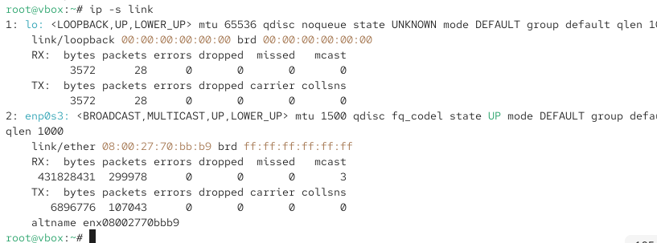
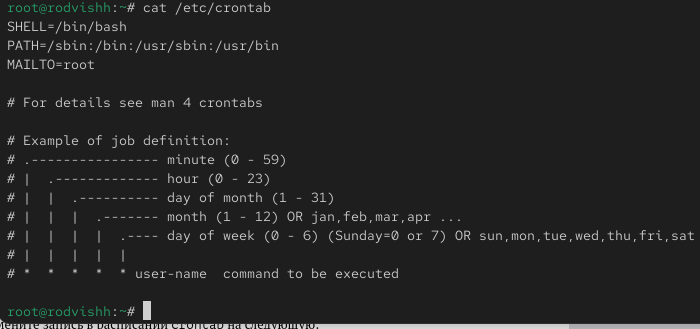
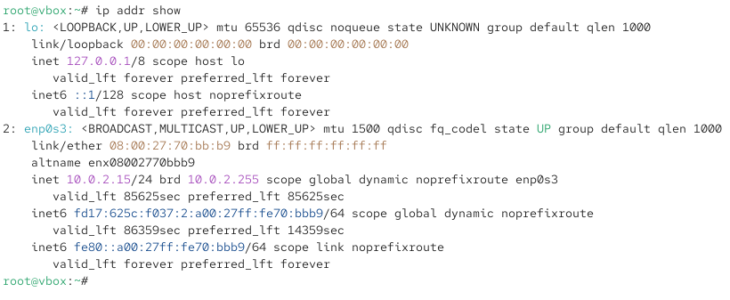
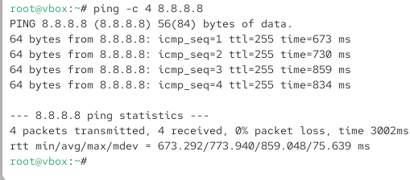
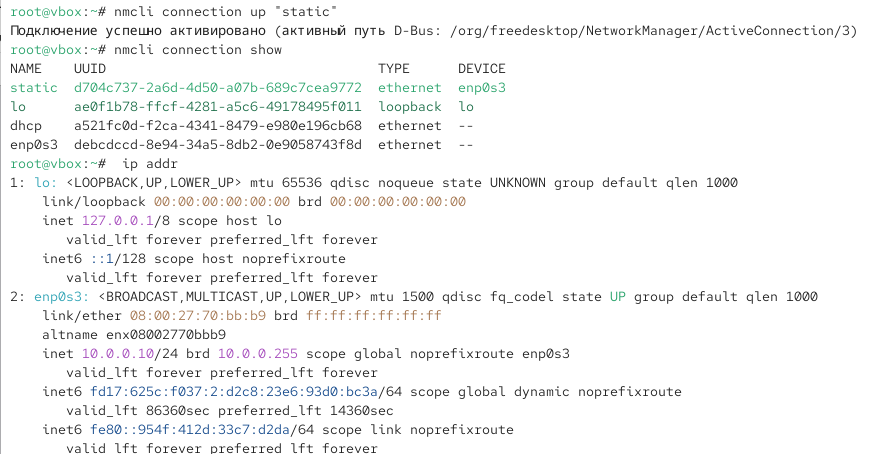

---
## Front matter
lang: ru-RU
title: Операционные системы
subtitle: Настройки сети в Linux
author:
  - Вишняков Родион Сергеевич
institute:
  - Российский университет дружбы народов, Москва, Россия
date: 22 ноября 2025

## i18n babel
babel-lang: russian
babel-otherlangs: english

## Formatting pdf
toc: false
toc-title: Содержание
slide_level: 2
aspectratio: 169
section-titles: true
theme: Madrid
---

# Цели и задачи работы

## Цель лабораторной работы

Получить навыки настройки сетевых параметров системы.

# Процесс выполнения лабораторной работы

## Получаем полномочия администратора

{ #fig:001 width=70% height=70% }

## Выводим на экран информацию о существующих сетевых подключениях, а также статистику о количестве отправленных пакетов и связанных с ними сообщениях об ошибках

{ #fig:002 width=70% height=70% }

## Выведим на экран информацию о текущих маршрутах

{ #fig:003 width=70% height=70% }

## Выведите на экран информацию о текущих назначениях адресов для сетевых интерфейсов на устройстве

{ #fig:004 width=70% height=70% }

## Используя команду ping для проверки правильности подключения к Интернету

{ #fig:005 width=70% height=70% }

## Добавляю дополнительный адрес к вашему интерфейсу

{ #fig:005 width=70% height=70% }

## Проверяю, что адрес добавился

{ #fig:005 width=70% height=70% }

## Сравниваю вывод информации от утилиты ip и от команды ifconfig

{ #fig:006 width=70% height=70% }

## Вывожу на экран список всех прослушиваемых системой портов UDP и TCP

{ #fig:006 width=70% height=70% }

## Вывожу на экран информацию о текущих соединениях

{ #fig:007 width=70% height=70% }

## Добавляю Ethernet-соединение с именем dhcp к интерфейсу

{ #fig:007 width=70% height=70% }

## Добавляю к этому же интерфейсу Ethernet-соединение с именем static, статическим IPv4-адресом адаптера и статическим адресом шлюза

{ #fig:007 width=70% height=70% }

## Вывожу информацию о текущих соединениях

{ #fig:008 width=70% height=70% }

## Переключаюсь на статическое соединение и проверяю успешность переключения 

{ #fig:009 width=70% height=70% }
 
## Переключаюсь на соединение dhcp и проверяю успешность переключения 

{ #fig:001 width=70% height=70% }

## Отключаю автоподключение статического соединение, добавляю DNS-сервер 1 и DNS-серевер 2, изменяю IP-адрес, добавляю другой IP-адрес, и активирую 

{ #fig:009 width=70% height=70% }

## Используя nmtui, просматриваю настройки сети на устройстве

{ #fig:009 width=70% height=70% }

## Посматриваю настройки сетевых соединений

{ #fig:009 width=70% height=70% }

## Переключаюсь на первоначальное сетевое соединение

{ #fig:009 width=70% height=70% }

# Выводы по проделанной работе

## Вывод

Мы получили навыки настройки сетевых параметров системы.

