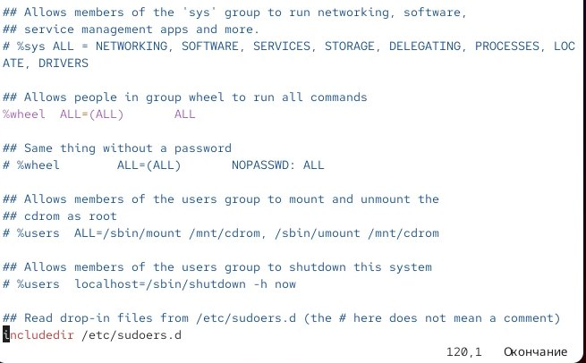
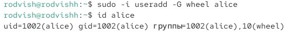
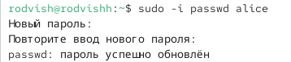
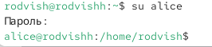
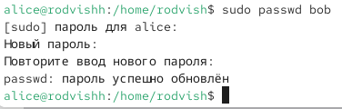
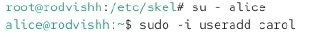
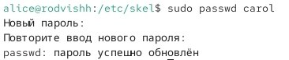
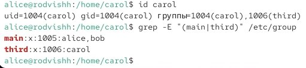

---
## Front matter
title: "Отчёт по лабораторной работе 2"
subtitle: "Управление пользователями и группами"
author: "Вишняков Родион Сергеевич"

## Generic otions
lang: ru-RU
toc-title: "Содержание"

## Bibliography

## Pdf output format
toc: true # Table of contents
toc-depth: 2
lof: true # List of figures
lot: true # List of tables
fontsize: 12pt
linestretch: 1.5
papersize: a4
documentclass: scrreprt
## I18n polyglossia
polyglossia-lang:
  name: russian
  options:
	- spelling=modern
	- babelshorthands=true
polyglossia-otherlangs:
  name: english
## I18n babel
babel-lang: russian
babel-otherlangs: english
## Fonts
mainfont: IBM Plex Serif
romanfont: IBM Plex Serif
sansfont: IBM Plex Sans
monofont: IBM Plex Mono
mathfont: STIX Two Math
mainfontoptions: Ligatures=Common,Ligatures=TeX,Scale=0.94
romanfontoptions: Ligatures=Common,Ligatures=TeX,Scale=0.94
sansfontoptions: Ligatures=Common,Ligatures=TeX,Scale=MatchLowercase,Scale=0.94
monofontoptions: Scale=MatchLowercase,Scale=0.94,FakeStretch=0.9
mathfontoptions:
## Biblatex
  - parentracker=true
  - backend=biber
  - hyperref=auto
  - language=auto
  - autolang=other*
  - citestyle=gost-numeric
## Pandoc-crossref LaTeX customization
figureTitle: "Рис."
tableTitle: "Таблица"
listingTitle: "Листинг"
lofTitle: "Список иллюстраций"
lotTitle: "Список таблиц"
lolTitle: "Листинги"
## Misc options
indent: true
header-includes:
  - \usepackage{indentfirst}
  - \usepackage{float} # keep figures where there are in the text
  - \floatplacement{figure}{H} # keep figures where there are in the text
---

# Цель работы

Получить представление о работе с учётными записями пользователей и группами
пользователей в операционной системе типа Linux.

# Выполнение лабораторной работы

Определяю какую учетную запись использую

{ #fig:001 width=70% height=70% }

Возвращаюсь к учетной записи своего пользователя

{ #fig:002 width=70% height=70% }

Просматриваю в безопасном режиме файл /etc/sudoers

{ #fig:003 width=70% height=70% }

Создаю пользователя alice, входящего в группу wheel, и проверяю это

{ #fig:004 width=70% height=70% }

Задаю пароль

{ #fig:005 width=70% height=70% }

Переключаюсь на пользователя alice

{ #fig:006 width=70% height=70% }

Создаю пользователя bob, и проверяю это

{ #fig:007 width=70% height=70% }

Задаю пароль

{ #fig:008 width=70% height=70% }

Переключаюсь на пользователя root, перехожу на каталог /etc/skel и создаю каталоги

{ #fig:009 width=70% height=70% }
 
Переключаюсь на пользователя alice и создаю пользователя carol

{ #fig:010 width=70% height=70% }
 
Задаю пароль

{ #fig:011 width=70% height=70% }

Просматриваю информацию о пользователе carol, убеждаюсь что каталоги создались

{ #fig:012 width=70% height=70% }

Меняю свойство пароля

{ #fig:013 width=70% height=70% }

Убеждаюсь в изменении с данными о пароле, убеждаюсь, что идентификатор alice существует по всех трех файлах, а идентификатор carol существует не во всех трех файлах

{ #fig:014 width=70% height=70% }

Создаю группы main и third, и добавляю alice и bob в main, а carol в third

{ #fig:015 width=70% height=70% }

Определяю, участники каких групп являются другие созданные пользователи

{ #fig:016 width=70% height=70% }

# Вывод

Получил представление о работе с учетными записями пользователей и группами пользователей ОС типа Linux.

# Контрольные вопросы

1. Вопрос: При помощи каких команд можно получить информацию о номере (идентификаторе), назначенном пользователю Linux, о группах, в которые включён пользователь? 
Ответ: Команда `id` показывает UID, GID и группы пользователя.

2. Вопрос: Какой UID имеет пользователь root? При помощи какой команды можно узнать UID пользователя? 
Ответ: Пользователь root имеет UID 0. Команда `id -u username` покажет UID, например: `id -u root`.

3. Вопрос: В чём состоит различие между командами su и sudo? 
Ответ: Команда `su` переключает пользователя с запросом пароля целевого пользователя, а `sudo` выполняет команду с правами root с запросом пароля текущего пользователя.

4. Вопрос: В каком конфигурационном файле определяются параметры sudo? 
Ответ: Параметры sudo определяются в файле `/etc/sudoers`.

5. Вопрос: Какую команду следует использовать для безопасного изменения конфигурации sudo? 
Ответ: Команду `visudo`, которая блокирует файл и проверяет синтаксис.

6. Вопрос: Если вы хотите предоставить пользователю доступ ко всем командам администрирования через sudo, членом какой группы он должен быть? 
Ответ: Пользователь должен быть членом группы `sudo` (в Debian/Ubuntu) или `wheel` (в RHEL/CentOS).

7. Вопрос: Какие файлы/каталоги можно использовать для определения параметров при создании учётных записей? 
Ответ: Файлы `/etc/login.defs` и `/etc/default/useradd` содержат настройки, например: `USERGROUPS_ENAB yes` или `CREATE_HOME yes`.

8. Вопрос: Где хранится информация о первичной и дополнительных группах пользователей? 
Ответ: В файле `/etc/group`. Запись `alice:x:1001:dev,projects` означает, что пользователь alice состоит в первичной группе 1001 и дополнительных группах dev и projects.

9. Вопрос: Какие команды вы можете использовать для изменения информации о пароле пользователя? 
Ответ: Команда `chage` изменяет срок действия пароля, например: `chage -M 90 alice`.

10. Вопрос: Какую команду следует использовать для прямого изменения информации в файле /etc/group и почему? 
Ответ: Команду `vigr`, которая блокирует файл и предотвращает конфликты при одновременном редактировании.
