---
## Front matter
title: "Отчёт по лабораторной работе 3"
subtitle: "Настройка прав доступа"
author: "Вишняков Родион Сергеевич"

## Generic otions
lang: ru-RU
toc-title: "Содержание"

## Bibliography

## Pdf output format
toc: true # Table of contents
toc-depth: 2
lof: true # List of figures
lot: true # List of tables
fontsize: 12pt
linestretch: 1.5
papersize: a4
documentclass: scrreprt
## I18n polyglossia
polyglossia-lang:
  name: russian
  options:
	- spelling=modern
	- babelshorthands=true
polyglossia-otherlangs:
  name: english
## I18n babel
babel-lang: russian
babel-otherlangs: english
## Fonts
mainfont: IBM Plex Serif
romanfont: IBM Plex Serif
sansfont: IBM Plex Sans
monofont: IBM Plex Mono
mathfont: STIX Two Math
mainfontoptions: Ligatures=Common,Ligatures=TeX,Scale=0.94
romanfontoptions: Ligatures=Common,Ligatures=TeX,Scale=0.94
sansfontoptions: Ligatures=Common,Ligatures=TeX,Scale=MatchLowercase,Scale=0.94
monofontoptions: Scale=MatchLowercase,Scale=0.94,FakeStretch=0.9
mathfontoptions:
## Biblatex
  - parentracker=true
  - backend=biber
  - hyperref=auto
  - language=auto
  - autolang=other*
  - citestyle=gost-numeric
## Pandoc-crossref LaTeX customization
figureTitle: "Рис."
tableTitle: "Таблица"
listingTitle: "Листинг"
lofTitle: "Список иллюстраций"
lotTitle: "Список таблиц"
lolTitle: "Листинги"
## Misc options
indent: true
header-includes:
  - \usepackage{indentfirst}
  - \usepackage{float} # keep figures where there are in the text
  - \floatplacement{figure}{H} # keep figures where there are in the text
---

# Цель работы

Получение навыков настройки базовых и специальных прав доступа для групп пользо-
вателей в операционной системе типа Linux.

# Выполнение лабораторной работы

Читаю справочное описание man по командам: chgrp, chmod, getfacl, setfacl

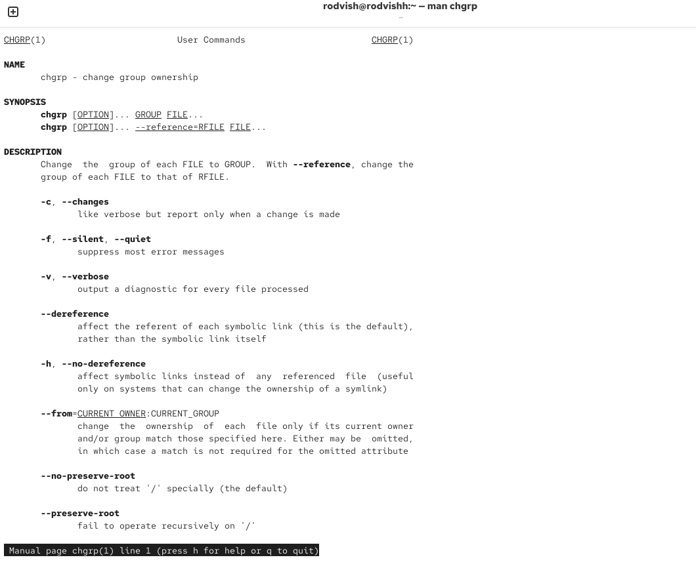{ #fig:001 width=70% height=70% }

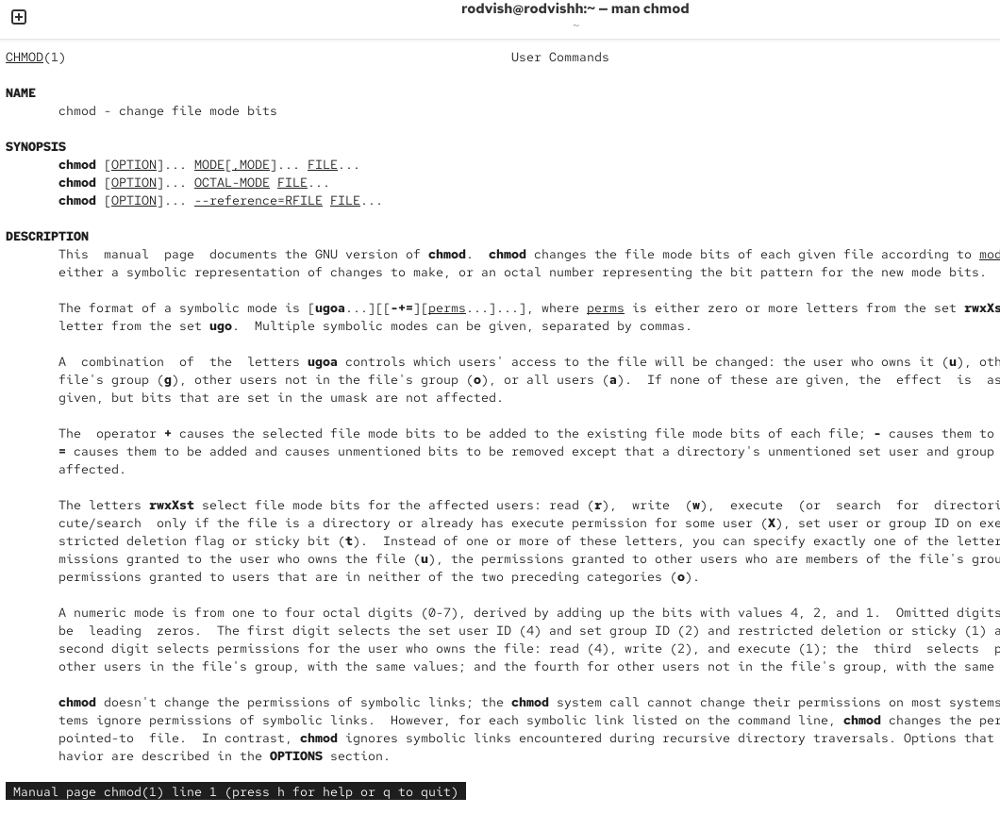{ #fig:002 width=70% height=70% }

{ #fig:003 width=70% height=70% }

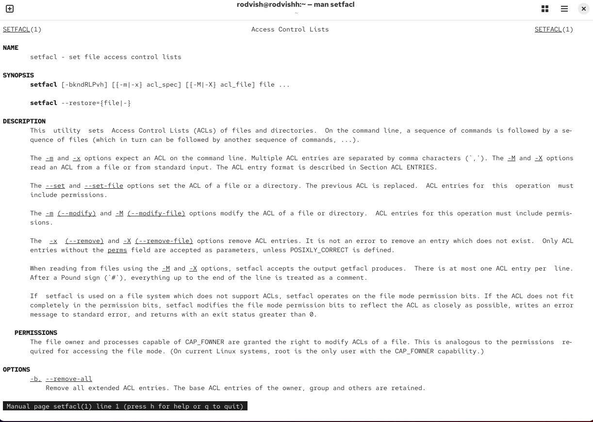{ #fig:004 width=70% height=70% }

Открываю терминал с учетной записью root

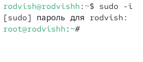{ #fig:005 width=70% height=70% }

Создаю каталоги и проверяю владельца каталогов

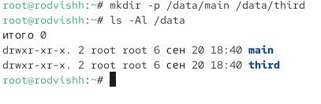{ #fig:006 width=70% height=70% }

Меняю владельцев каталогов

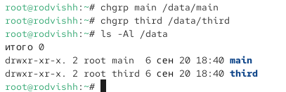{ #fig:007 width=70% height=70% }

Устанавливаю необходимые разрешения

{ #fig:008 width=70% height=70% }

Перехожу на учетную запись bob

{ #fig:009 width=70% height=70% }
 
Пытаюсь создать файл в каталоге main

{ #fig:010 width=70% height=70% }
 
Пытаюсь создать файл в каталоге third

{ #fig:011 width=70% height=70% }

Перехожу на учетную запись alice

{ #fig:012 width=70% height=70% }

Создаю два файла в каталоге main

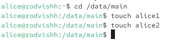{ #fig:013 width=70% height=70% }
 
 Перехожу на учетную запись bob

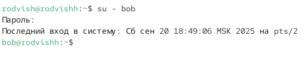{ #fig:014 width=70% height=70% }

Попытка удалить файлы 

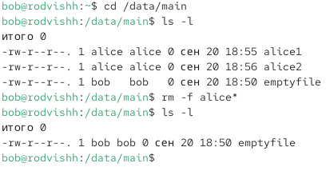{ #fig:015 width=70% height=70% }

Создаю два файла

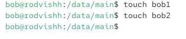{ #fig:016 width=70% height=70% }

Устанавливаю бит идентификатора группы и stiky-бит

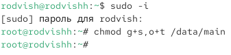{ #fig:017 width=70% height=70% }

Создаю файлы

{ #fig:018 width=70% height=70% }

Пытаюсь удалить файлы

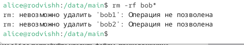{ #fig:019 width=70% height=70% }

Перехожу на учетную запись root

{ #fig:020 width=70% height=70% }

Устанавливаю необходимые права

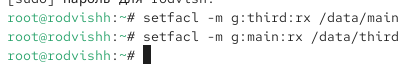{ #fig:021 width=70% height=70% }

Убеждаюсь в правильности установки разрешений

{ #fig:022 width=70% height=70% }

Создаю файл и проверяю текущие назначения полномочий

{ #fig:023 width=70% height=70% }

Устанавливаю ACL

{ #fig:024 width=70% height=70% }

{ #fig:025 width=70% height=70% }

Проверяю работоспособность ACL

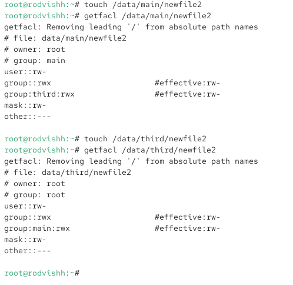{ #fig:026 width=70% height=70% }

Осуществляю заданные проверки

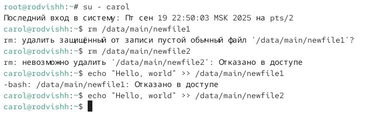{ #fig:027 width=70% height=70% }

# Вывод

В ходе работы были получены практические навыки управления правами доступа в Linux. Освоены базовые механизмы (chmod, chown), специальные атрибуты (setuid, setgid, sticky bit) и расширенные списки доступа ACL (setfacl, getfacl). Приобретён опыт настройки прав для групп пользователей, проверки наследования разрешений и обеспечения безопасности данных. Цель работы достигнута. 

# Контрольные вопросы

1. Вопрос: Как следует использовать команду chown, чтобы установить владельца группы для файла? Приведите пример. 
Ответ: Для установки владельца группы используется синтаксис `chown :GROUPNAME FILENAME`. Пример: `chown :developers myfile.txt`.

2. Вопрос: С помощью какой команды можно найти все файлы, принадлежащие конкретному пользователю? Приведите пример. 
Ответ: Команда `find / -user USERNAME`. Пример: `find /home -user ivanov`.

3. Вопрос: Как применить разрешения на чтение, запись и выполнение для всех файлов в каталоге /data для пользователей и владельцев групп, не устанавливая никаких прав для других? 
Ответ:Команда `chmod -R ug=rwX,o= /data`. Флаг `X` устанавливает выполнение только для каталогов.

4. Вопрос: Какая команда позволяет добавить разрешение на выполнение для файла, который необходимо сделать исполняемым? 
Ответ: Команда `chmod +x FILENAME`. Пример: `chmod +x script.sh`.

5. Вопрос: Какая команда гарантирует наследование групповых разрешений для новых файлов в каталоге? 
Ответ: Команда `chmod g+s DIRECTORY`. Пример: `chmod g+s /shared/data`.

6. Вопрос: Как разрешить пользователям удалять только свои файлы в каталоге? 
Ответ: Команда `chmod +t DIRECTORY` устанавливает sticky bit. Пример: `chmod +t /tmp`.

7. Вопрос: Какая команда добавляет ACL для чтения членам группы для всех файлов в каталоге? 
Ответ: Команда `setfacl -m g:GROUPNAME:r *`. Пример: `setfacl -m g:readers:r *`.

8. Вопрос: Как гарантировать права на чтение для группы для всех существующих и будущих файлов в каталоге? 
Ответ: Команды: 
`setfacl -R -m g:GROUPNAME:r DIRECTORY` 
`setfacl -R -d -m g:GROUPNAME:r DIRECTORY`

9. Вопрос: Какое значение umash запретит права для "других" пользователей? 
Ответ: Значение `umask 007`. Новые файлы: 660 (rw-rw----), каталоги: 770 (rwxrwx---).

10. Вопрос: Как защитить файл от случайного удаления? 
Ответ: Команда `chmod a-w myfile` снимает права на запись у всех пользователей.
