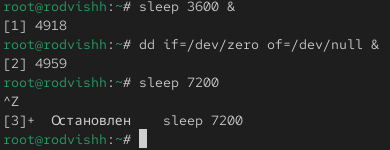
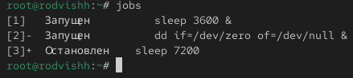
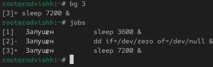
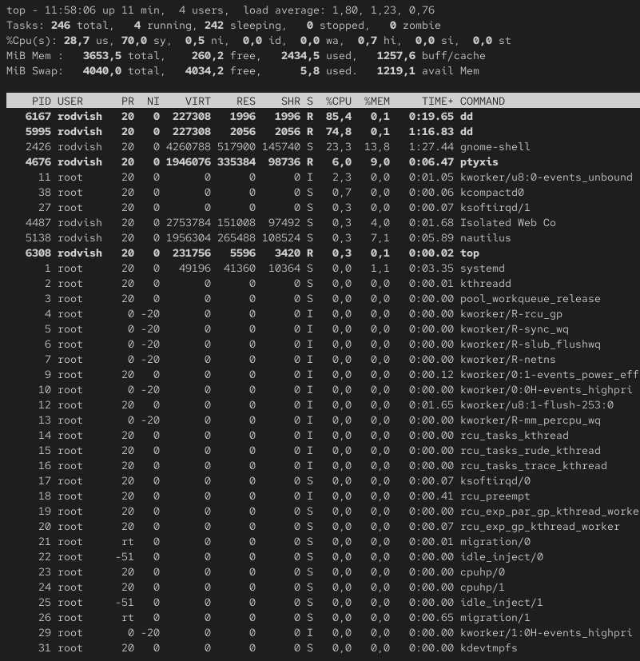
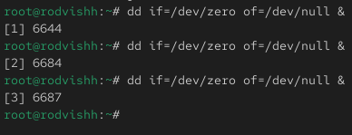
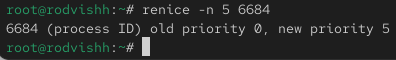
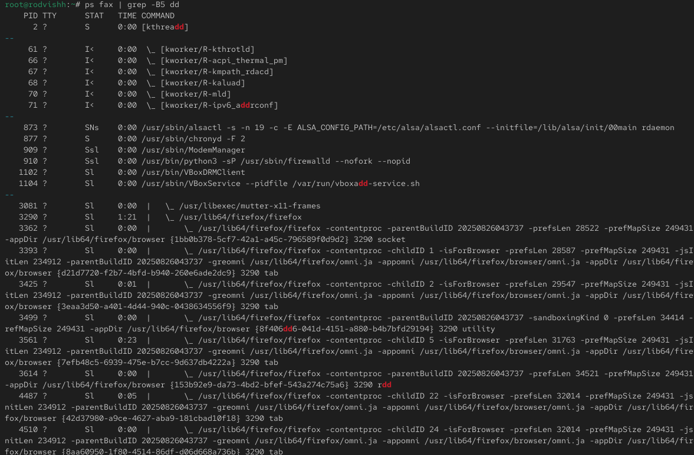
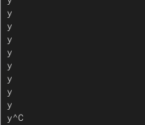
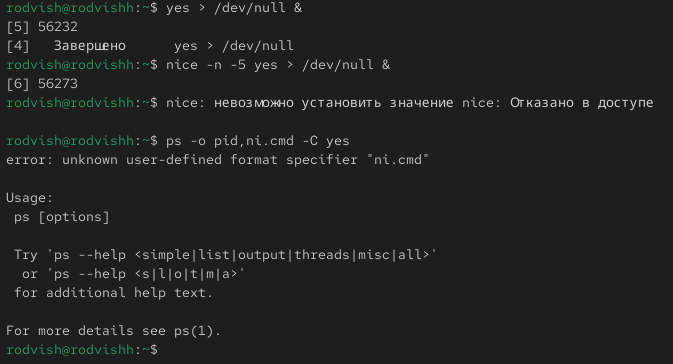

---
## Front matter
title: "Отчёт по лабораторной работе 6"
subtitle: "Управление процессами"
author: "Вишняков Родион Сергеевич"

## Generic otions
lang: ru-RU
toc-title: "Содержание"

## Bibliography

## Pdf output format
toc: true # Table of contents
toc-depth: 2
lof: true # List of figures
lot: true # List of tables
fontsize: 12pt
linestretch: 1.5
papersize: a4
documentclass: scrreprt
## I18n polyglossia
polyglossia-lang:
  name: russian
  options:
	- spelling=modern
	- babelshorthands=true
polyglossia-otherlangs:
  name: english
## I18n babel
babel-lang: russian
babel-otherlangs: english
## Fonts
mainfont: IBM Plex Serif
romanfont: IBM Plex Serif
sansfont: IBM Plex Sans
monofont: IBM Plex Mono
mathfont: STIX Two Math
mainfontoptions: Ligatures=Common,Ligatures=TeX,Scale=0.94
romanfontoptions: Ligatures=Common,Ligatures=TeX,Scale=0.94
sansfontoptions: Ligatures=Common,Ligatures=TeX,Scale=MatchLowercase,Scale=0.94
monofontoptions: Scale=MatchLowercase,Scale=0.94,FakeStretch=0.9
mathfontoptions:
## Biblatex
  - parentracker=true
  - backend=biber
  - hyperref=auto
  - language=auto
  - autolang=other*
  - citestyle=gost-numeric
## Pandoc-crossref LaTeX customization
figureTitle: "Рис."
tableTitle: "Таблица"
listingTitle: "Листинг"
lofTitle: "Список иллюстраций"
lotTitle: "Список таблиц"
lolTitle: "Листинги"
## Misc options
indent: true
header-includes:
  - \usepackage{indentfirst}
  - \usepackage{float} # keep figures where there are in the text
  - \floatplacement{figure}{H} # keep figures where there are in the text
---

# Цель работы

Получить навыки управления процессами операционной системы.

# Выполнение лабораторной работы

Получаем полномочия администратора

{ #fig:001 width=70% height=70% }

Вводим предоставленные команды

{ #fig:002 width=70% height=70% }

Вводим команду jobs 

{ #fig:003 width=70% height=70% }

Вводим команду для продолжения выполнения задания 3 в фоновом и смотрим изменения

{ #fig:004 width=70% height=70% }

Перемещаем задания 1,2,3 на передний план 

{ #fig:005 width=70% height=70% }

Вводим предоставленные команды

{ #fig:005 width=70% height=70% }

Запускаем top

{ #fig:005 width=70% height=70% }

Вновь используем top и убиваем задание dd

{ #fig:006 width=70% height=70% }

Вводим предоставленные команды

{ #fig:006 width=70% height=70% }

Смотрим все строки, в которых есть буквы dd

{ #fig:007 width=70% height=70% }

Меняем приоритет

{ #fig:007 width=70% height=70% }

Смотрим строки с параметров -B5

{ #fig:007 width=70% height=70% }

Останавливаем родительский процесс

{ #fig:008 width=70% height=70% }

Выполняем задание для самостоятельной работы

{ #fig:009 width=70% height=70% }
 
Выполняем задание для самостоятельной работы

{ #fig:009 width=70% height=70% }

Выполняем задание для самостоятельной работы

{ #fig:009 width=70% height=70% }

Выполняем задание для самостоятельной работы

{ #fig:009 width=70% height=70% }

Выполняем задание для самостоятельной работы

{ #fig:009 width=70% height=70% }

Выполняем задание для самостоятельной работы

{ #fig:009 width=70% height=70% }

Выполняем задание для самостоятельной работы

{ #fig:009 width=70% height=70% }

Выполняем задание для самостоятельной работы

{ #fig:009 width=70% height=70% }

Выполняем задание для самостоятельной работы

{ #fig:009 width=70% height=70% }

Выполняем задание для самостоятельной работы

{ #fig:009 width=70% height=70% }

Выполняем задание для самостоятельной работы

{ #fig:009 width=70% height=70% }

Выполняем задание для самостоятельной работы

{ #fig:009 width=70% height=70% }

Выполняем задание для самостоятельной работы

{ #fig:009 width=70% height=70% }

Выполняем задание для самостоятельной работы

{ #fig:009 width=70% height=70% }

# Вывод

Мы получили навыки управления процессами операционной системы

# Контрольные вопросы

1. Какая команда даёт обзор всех текущих заданий оболочки?
Ответ: `jobs`

2. Как остановить текущее задание оболочки, чтобы продолжить его выполнение в фоновом режиме?
Ответ:
- Нажать `Ctrl+Z` для остановки (приостановки)
- Затем выполнить `bg` для продолжения в фоновом режиме

3. Какую комбинацию клавиш можно использовать для отмены текущего задания оболочки?
Ответ: `Ctrl+C`

4. Необходимо отменить одно из начатых заданий. Доступ к оболочке, в которой в данный момент работает пользователь, невозможен. Что можно сделать, чтобы отменить задание?
Ответ: 
- Найти PID процесса: `ps aux | grep имя_процесса`
- Завершить процесс: `kill PID`
- Или завершить по имени: `killall имя_процесса`

5. Какая команда используется для отображения отношений между родительскими и дочерними процессами?
Ответ: `ps fax` или `pstree`

6. Какая команда позволит изменить приоритет процесса с идентификатором 1234 на более высокий?
Ответ: `renice -n -5 1234` (только для root) 
Для обычного пользователя можно только понизить приоритет: `renice -n 5 1234`

7. В системе в настоящее время запущено 20 процессов dd. Как проще всего остановить их все сразу?
Ответ: `killall dd`

8. Какая команда позволяет остановить команду с именем mycommand?
Ответ: `pkill mycommand` или `killall mycommand`

9. Какая команда используется в top, чтобы убить процесс?
Ответ:
- В `top` нажать `k`
- Ввести PID процесса
- Ввести сигнал (по умолчанию 15, для принудительного завершения - 9)

10. Как запустить команду с достаточно высоким приоритетом, не рискуя, что не хватит ресурсов для других процессов?
Ответ:
- Для обычного пользователя: `nice -n 10 команда` (устанавливает низкий приоритет)
- Для root: можно установить отрицательное значение, но с осторожностью
- Альтернативно: использовать `ionice` для управления I/O приоритетом
