---
## Front matter
title: "Отчёт по лабораторной работе 7"
subtitle: "Управление журналами событий в системе"
author: "Вишняков Родион Сергеевич"

## Generic otions
lang: ru-RU
toc-title: "Содержание"

## Bibliography

## Pdf output format
toc: true # Table of contents
toc-depth: 2
lof: true # List of figures
lot: true # List of tables
fontsize: 12pt
linestretch: 1.5
papersize: a4
documentclass: scrreprt
## I18n polyglossia
polyglossia-lang:
  name: russian
  options:
	- spelling=modern
	- babelshorthands=true
polyglossia-otherlangs:
  name: english
## I18n babel
babel-lang: russian
babel-otherlangs: english
## Fonts
mainfont: IBM Plex Serif
romanfont: IBM Plex Serif
sansfont: IBM Plex Sans
monofont: IBM Plex Mono
mathfont: STIX Two Math
mainfontoptions: Ligatures=Common,Ligatures=TeX,Scale=0.94
romanfontoptions: Ligatures=Common,Ligatures=TeX,Scale=0.94
sansfontoptions: Ligatures=Common,Ligatures=TeX,Scale=MatchLowercase,Scale=0.94
monofontoptions: Scale=MatchLowercase,Scale=0.94,FakeStretch=0.9
mathfontoptions:
## Biblatex
  - parentracker=true
  - backend=biber
  - hyperref=auto
  - language=auto
  - autolang=other*
  - citestyle=gost-numeric
## Pandoc-crossref LaTeX customization
figureTitle: "Рис."
tableTitle: "Таблица"
listingTitle: "Листинг"
lofTitle: "Список иллюстраций"
lotTitle: "Список таблиц"
lolTitle: "Листинги"
## Misc options
indent: true
header-includes:
  - \usepackage{indentfirst}
  - \usepackage{float} # keep figures where there are in the text
  - \floatplacement{figure}{H} # keep figures where there are in the text
---

# Цель работы

Получить навыки работы с журналами мониторинга различных событий в системе.

# Выполнение лабораторной работы

Получаем полномочия администратора

{ #fig:001 width=70% height=70% }

Запускаю мониторинг системных событий в реальном времени

{ #fig:002 width=70% height=70% }

Ввожу предоставленные команды

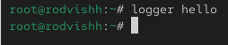{ #fig:003 width=70% height=70% }

Получаю сообщение из мониторинга событий

{ #fig:004 width=70% height=70% }

Просматриваю последний 20 строк из мониторинга сообщений безопасности 

{ #fig:005 width=70% height=70% }

Устанавливаю Apache

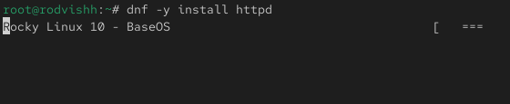{ #fig:005 width=70% height=70% }

Запускаю веб-службу

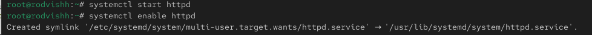{ #fig:005 width=70% height=70% }

Просматриваю журнал сообщений об ошибках веб-службы

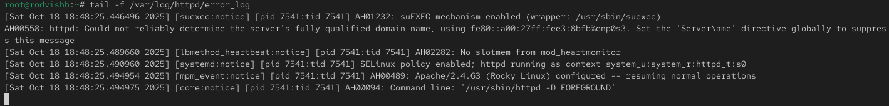{ #fig:006 width=70% height=70% }

Добавляю предоставленную строку в конец

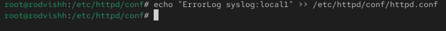{ #fig:006 width=70% height=70% }

Создаю файл мониторинга событий веб-службы и прописываю в нем следующую команду

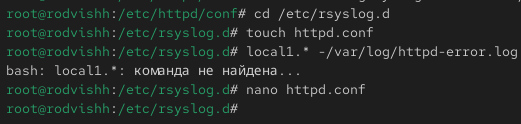{ #fig:007 width=70% height=70% }

Перезагружаю конфигурацию rsyslogd и веб-службу

{ #fig:007 width=70% height=70% }

Создаю файл конфигурации для мониторинга отладочной информации и ввожу следующую команду

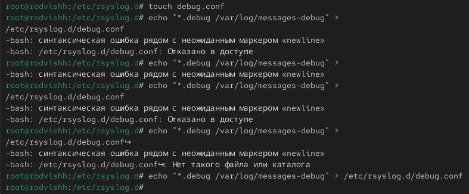{ #fig:007 width=70% height=70% }

Перезапускаю rsyslogd

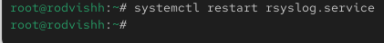{ #fig:008 width=70% height=70% }

Запускаю мониторинг отладочной информации

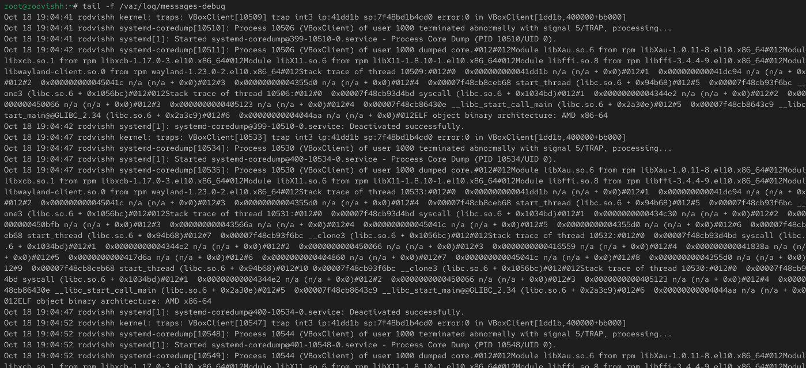{ #fig:009 width=70% height=70% }
 
Ввожу предоставленную команду

{ #fig:009 width=70% height=70% }

Просматриваю содержимое журнала с событиями с момента последнего запуска системы

{ #fig:009 width=70% height=70% }

Просматриваю содержимое журнала без использования пейджера

{ #fig:009 width=70% height=70% }

Просматриваю содержимое в реальном времени

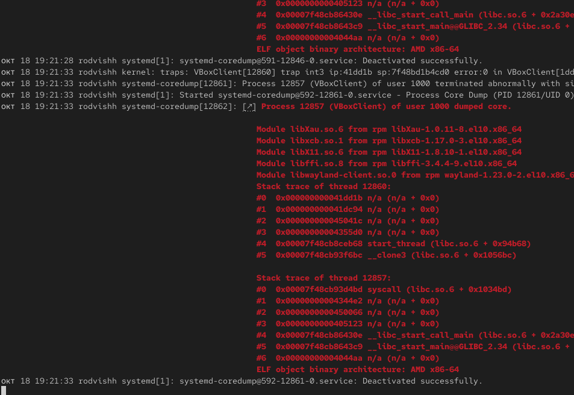{ #fig:009 width=70% height=70% }

Просматриваю конкретные параметры

{ #fig:009 width=70% height=70% }

Просматриваю события для UIDO

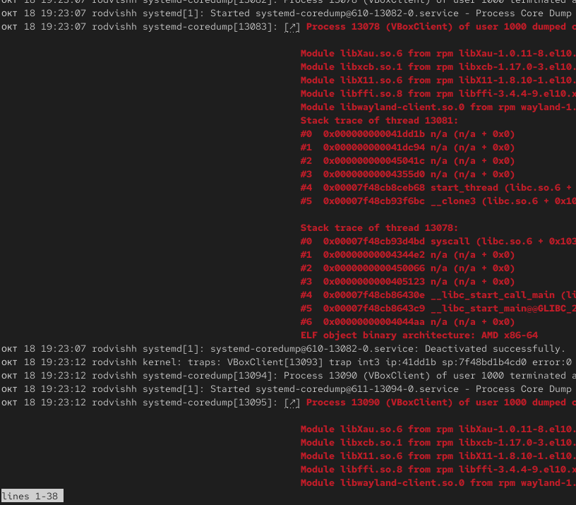{ #fig:009 width=70% height=70% }

Просматриваю последний 20 строк журнала

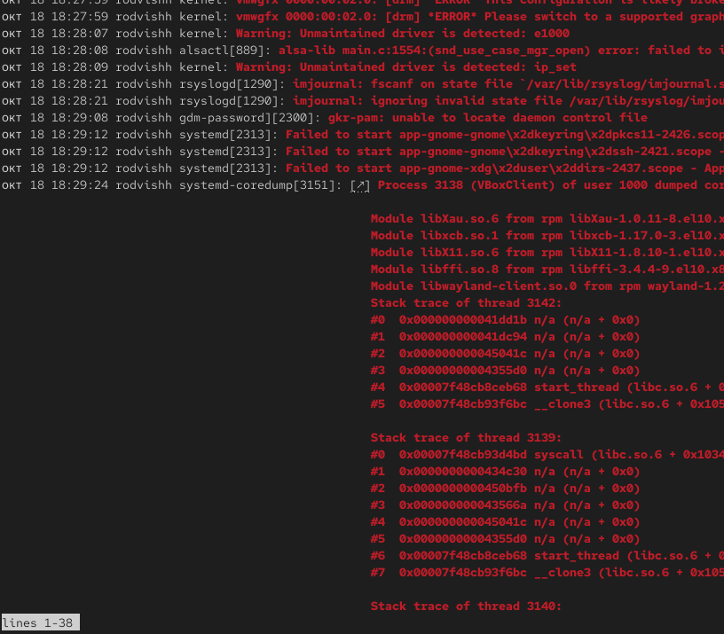{ #fig:009 width=70% height=70% }

Просматриваю только сообщения об ошибках

{ #fig:009 width=70% height=70% }

Просматриваю все сообщения вчерашнего дня

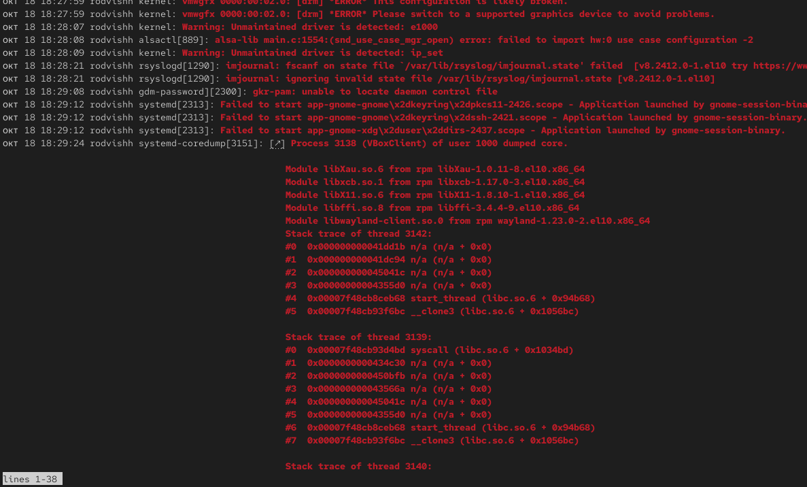{ #fig:009 width=70% height=70% }

Просматриваю сообщения с ошибкой приоритета со вчерашнего дня

{ #fig:009 width=70% height=70% }

Просматриваю дополнительную информацию о модуле sshd

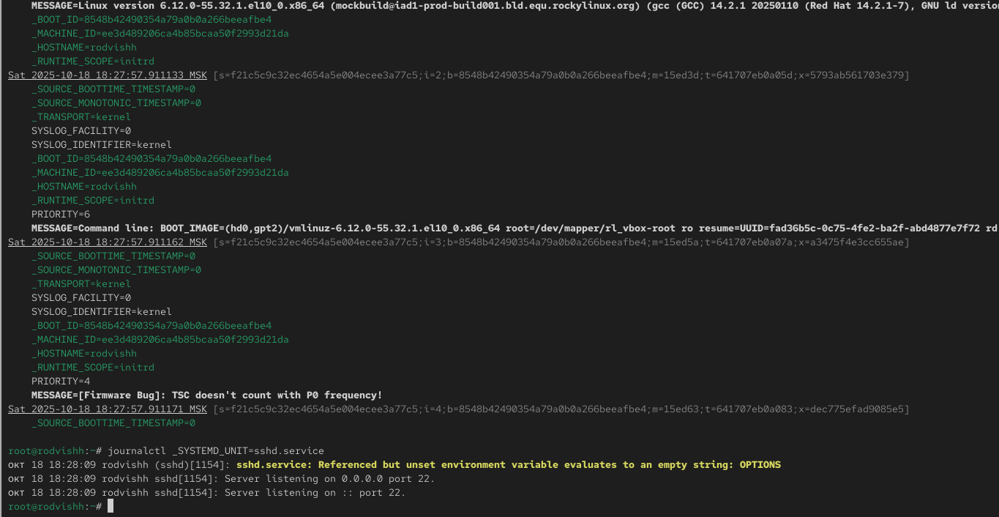{ #fig:009 width=70% height=70% }

Создаю каталог для хранения записей журнала

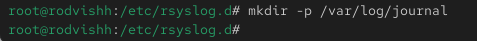{ #fig:009 width=70% height=70% }

Корректирую права доступа 

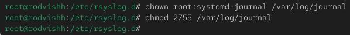{ #fig:009 width=70% height=70% }

Для принятия изменений ввожу следующую команду

{ #fig:009 width=70% height=70% }

# Вывод

Мы получили навыки работы с журналами мониторинга различных событий в системе.

# Контрольные вопросы

1. Какой файл используется для настройки rsyslogd?
   `/etc/rsyslog.conf`

2. В каком файле журнала rsyslogd содержатся сообщения, связанные с аутентификацией?
   `/var/log/auth.log` (в Red Hat-системах — `/var/log/secure`)

3. Если вы ничего не настроите, то сколько времени потребуется для ротации файлов журналов?
   Еженедельно

4. Какую строку следует добавить в конфигурацию для записи всех сообщений с приоритетом info в файл /var/log/messages.info?
   `*.info /var/log/messages.info`

5. Какая команда позволяет вам видеть сообщения журнала в режиме реального времени?
   `tail -f` для файлов журналов или `journalctl -f` для systemd

6. Какая команда позволяет вам видеть все сообщения журнала, которые были написаны для PID 1 между 9:00 и 15:00?
   `journalctl _PID=1 --since="09:00" --until="15:00"`

7. Какая команда позволяет вас видеть сообщения journald после последней перезагрузки системы?
   `journalctl -b`

8. Какая процедура позволяет сделать журнал journald постоянным?
   Создать директорию `/var/log/journal` и перезапустить systemd-journald
